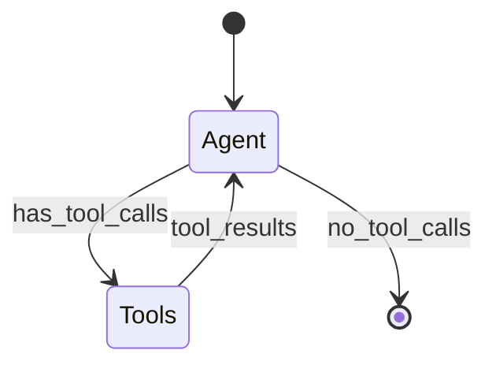

# Image Generation Prompts

This file contains prompts for generating images for the blog post. Use these with your preferred AI image generator.

## Recommended Tools

| Tool | Best For | Link |
|------|----------|------|
| **Eraser DiagramGPT** | Technical architecture diagrams | [eraser.io/diagramgpt](https://www.eraser.io/diagramgpt) |
| **Excalidraw** | Hand-drawn style diagrams | [excalidraw.com](https://excalidraw.com) |
| **DALL-E 3** | Hero images, conceptual art | [openai.com](https://openai.com/dall-e-3) |
| **Midjourney** | Artistic renders, mood images | [midjourney.com](https://midjourney.com) |
| **Leonardo AI** | Stylized technical illustrations | [leonardo.ai](https://leonardo.ai) |
| **Google Gemini** | Quick concept images | [gemini.google.com](https://gemini.google.com) |

---

## 1. Hero/Cover Image

**Filename:** `hero-banner.png`
**Dimensions:** 1200x630px (social media optimized)

### DALL-E / Midjourney Prompt:
```
A futuristic digital illustration showing multiple AI agents working together
in a neural network. Three glowing orbs (blue, green, orange) connected by
flowing data streams, representing orchestration, documentation search, and
code query agents. Dark blue gradient background with subtle circuit patterns.
Modern, clean, tech startup aesthetic. No text.
```

### Alternative (Minimalist):
```
Abstract geometric illustration of three interconnected hexagons with data
flowing between them. Colors: deep blue (#1e3a5f), teal (#14b8a6), orange
(#f97316). Clean white background. Flat design, modern tech style.
```

---

## 2. Architecture Overview Diagram

**Filename:** `architecture-overview.png`
**Dimensions:** 1000x600px

### Eraser DiagramGPT Prompt:
```
Create a system architecture diagram showing:
- User Query box at top
- Orchestrator Agent in center (main coordinator)
- Two parallel branches: Doc Search Agent (connects to Tavily API) and
  Code Query Agent (connects to Oracle Database)
- OpenTelemetry spans wrapping all components
- Final Combined Response at bottom
- Use blue color scheme with orange highlights
```

### Excalidraw Description:
Create a hand-drawn style flowchart:
1. Top: User icon with "Query" bubble
2. Center: Large box "Orchestrator" with routing arrows
3. Left branch: "Doc Search" -> "Tavily API" (cloud icon)
4. Right branch: "Code Query" -> "Oracle DB" (database cylinder)
5. Bottom: Merge arrows to "Response"
6. Dotted line around everything labeled "OpenTelemetry Trace"

---

## 3. LangGraph State Flow

**Filename:** `langgraph-flow.png`
**Dimensions:** 800x500px

### Eraser DiagramGPT Prompt:
```
Create a state machine diagram for LangGraph agent:
- START node
- Agent Node (reasoning step)
- Conditional edge: "has_tool_calls?"
- If yes: Tool Node (execute tools)
- Tool Node loops back to Agent Node
- If no: END node
- Show state object flowing between nodes
- Use green and blue colors
```

### Mermaid.js Code (for GitHub rendering):


---

## 4. Trace Visualization

**Filename:** `jaeger-trace.png`
**Dimensions:** 1000x400px

### Screenshot Instructions:
1. Run the application with a sample query
2. Open Jaeger UI at http://localhost:16686
3. Select service "code-assistant"
4. Find a trace with 8+ spans
5. Expand all spans
6. Screenshot the waterfall view
7. Annotate with callouts if needed

### Alternative - Illustrated Version (DALL-E):
```
Technical illustration of a distributed trace waterfall diagram. Horizontal
bars of varying lengths stacked vertically, showing parent-child relationships.
Colors: blue for orchestrator spans, green for doc search, orange for code
query. Timeline axis at top. Clean, flat design on dark background.
```

---

## 5. Tech Stack Icons

**Filename:** `tech-stack.png`
**Dimensions:** 800x200px

### Canva/Figma Instructions:
Arrange official logos horizontally with labels:
- LangGraph logo
- Claude/Anthropic logo
- Oracle Database logo
- Tavily logo
- OpenTelemetry logo
- Jaeger logo
- Streamlit logo
- Docker logo

Use consistent sizing (64x64px each) with subtle drop shadows.

---

## 6. Database Schema Visualization

**Filename:** `database-schema.png`
**Dimensions:** 600x400px

### dbdiagram.io Code:
```
Table code_snippets {
  id integer [pk, increment]
  title varchar(200) [not null]
  description varchar(2000)
  language varchar(50) [not null]
  framework varchar(100)
  category varchar(100)
  difficulty varchar(20)
  code clob [not null]
  tags varchar(500)
  source_url varchar(500)
  created_at timestamp
}
```

### Eraser Prompt:
```
Create an ERD for a code_snippets table with fields: id (PK), title,
description, language, framework, category, difficulty, code, tags,
source_url, created_at. Show data types. Single table, clean design.
```

---

## 7. OpenTelemetry Flow

**Filename:** `otel-flow.png`
**Dimensions:** 900x350px

### Eraser DiagramGPT Prompt:
```
Create a data flow diagram showing OpenTelemetry pipeline:
- Application box with "Tracer" inside
- Arrow to "BatchSpanProcessor"
- Arrow to "OTLP Exporter"
- Arrow (labeled "gRPC :4317") to "Jaeger Collector"
- Jaeger Collector to "Jaeger UI"
- Use standard OpenTelemetry colors (blue/purple)
```

---

## 8. Streamlit UI Screenshot

**Filename:** `streamlit-ui.png`
**Dimensions:** 1200x800px

### Screenshot Instructions:
1. Run `streamlit run streamlit_app.py`
2. Enter a sample query: "How do I connect to Oracle database in Python?"
3. Wait for response to complete
4. Capture full page including:
   - Chat messages
   - Agent activity sidebar
   - Trace visualization
5. Use browser DevTools to hide any sensitive data

---

## 9. Query Routing Decision Tree

**Filename:** `routing-logic.png`
**Dimensions:** 700x500px

### Eraser/Draw.io Prompt:
```
Create a decision tree flowchart:
- Start: "User Query"
- Decision: "Contains 'how', 'what', 'why'?"
  - Yes: Set needs_docs = true
- Decision: "Contains 'code', 'example', 'snippet'?"
  - Yes: Set needs_code = true
- Decision: "Neither flag set?"
  - Yes: Set both = true
- End: "Route to selected agents"
- Use diamond shapes for decisions, rectangles for actions
```

---

## 10. Performance Comparison Chart

**Filename:** `performance-chart.png`
**Dimensions:** 800x400px

### Chart.js / Matplotlib Data:
```python
import matplotlib.pyplot as plt

components = ['Orchestrator', 'Doc Search', 'Code Query', 'LLM Calls', 'DB Query']
times_ms = [45, 1100, 890, 1230, 95]
colors = ['#3b82f6', '#22c55e', '#f97316', '#8b5cf6', '#ef4444']

plt.barh(components, times_ms, color=colors)
plt.xlabel('Time (ms)')
plt.title('Query Processing Time Breakdown')
plt.tight_layout()
plt.savefig('performance-chart.png', dpi=150)
```

---

## Quick Generation Checklist

- [ ] hero-banner.png
- [ ] architecture-overview.png
- [ ] langgraph-flow.png
- [ ] jaeger-trace.png (screenshot)
- [ ] tech-stack.png
- [ ] database-schema.png
- [ ] otel-flow.png
- [ ] streamlit-ui.png (screenshot)
- [ ] routing-logic.png
- [ ] performance-chart.png

---

## Notes

- All images should be optimized for web (PNG or WebP)
- Use consistent color palette across all diagrams
- Keep file sizes under 500KB each
- Include alt text in blog post for accessibility
